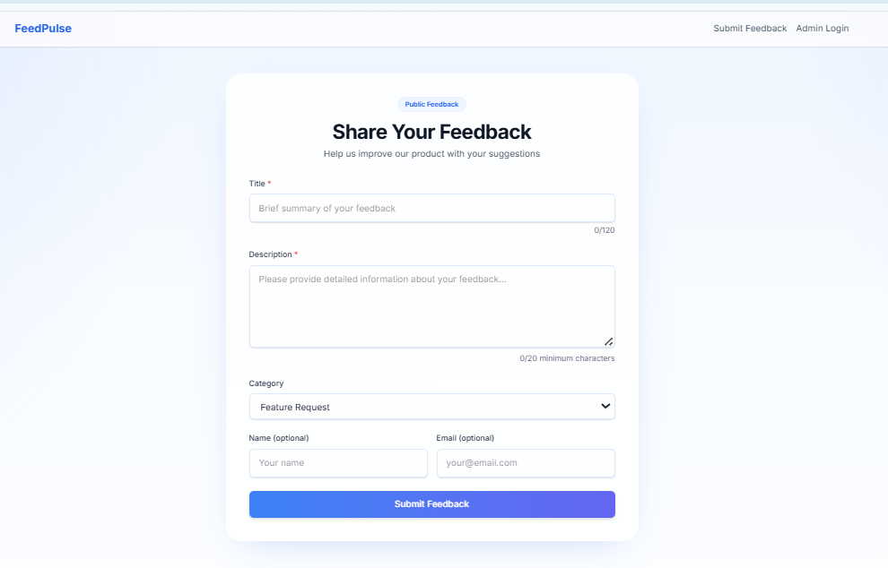

# FeedPulse

FeedPulse is an AI-powered product feedback platform. It lets users submit feedback publicly, stores submissions in MongoDB, and uses Google Gemini to automatically categorize, prioritize, and summarize incoming feedback for admins.

## Tech Stack

- Frontend: Next.js 16, React, TypeScript, Tailwind CSS
- Backend: Node.js, Express, TypeScript
- Database: MongoDB + Mongoose
- AI: Google Gemini `gemini-1.5-flash`
- Auth: Simple JWT-based admin login

## Features

### Public Feedback Form
- Public feedback submission page
- Fields for title, description, category, name, and email
- Client-side validation
- Success and error states
- Character counter for the description field.

### AI Analysis
- Gemini runs on each submission
- Stores category, sentiment, priority score, summary, and tags
- AI failure does not block feedback submission
- Weekly summary endpoint for top themes

### Admin Dashboard
- Protected admin login
- View all feedback in a table
- Filter by category and status
- Search, sorting, and pagination
- Update feedback status
- Stats for total feedback, open items, average priority, and most common tag

### API
- `POST /api/feedback`
- `GET /api/feedback`
- `GET /api/feedback/:id`
- `PATCH /api/feedback/:id`
- `DELETE /api/feedback/:id`
- `GET /api/feedback/summary`
- `POST /api/auth/login`

## Project Structure

```text
FeedPulse/
├── backend/
│   └── src/
│       ├── controllers/
│       ├── middleware/
│       ├── models/
│       ├── routes/
│       ├── services/
│       ├── utils/
│       └── index.ts
├── frontend/
│   └── app/
│       ├── dashboard/
│       ├── login/
│       ├── globals.css
│       ├── layout.tsx
│       └── page.tsx
└── README.md
```

## Environment Variables

### Backend `.env`

```env
PORT=4000
MONGODB_URI=mongodb+srv://<username>:<password>@<cluster>/<db>?retryWrites=true&w=majority&appName=Cluster0
GEMINI_API_KEY=your_gemini_api_key
JWT_SECRET=your_jwt_secret
ADMIN_EMAIL=admin@feedpulse.com
ADMIN_PASSWORD=admin123
```

### Frontend `.env.local`

```env
NEXT_PUBLIC_API_URL=http://localhost:4000
```

## Run Locally

### 1. Clone the repository
```bash
git clone <your-repo-url>
cd FeedPulse
```

### 2. Install backend dependencies
```bash
cd backend
npm install
```

### 3. Configure backend env
Create `backend/.env` and fill in the variables listed above.

### 4. Start the backend
```bash
npm run dev
```
Backend runs on `http://localhost:4000`.

### 5. Install frontend dependencies
Open a second terminal:
```bash
cd frontend
npm install
```

### 6. Configure frontend env
Create `frontend/.env.local`:
```bash
NEXT_PUBLIC_API_URL=http://localhost:4000
```

### 7. Start the frontend
```bash
npm run dev
```
Frontend runs on `http://localhost:3000`.

## Demo Credentials

- Email: `admin@feedpulse.com`
- Password: `feedplusadmin`

## Screenshots

### Public Feedback Form


### Admin Dashboard


## Notes

- `.env` and `node_modules` are ignored via `.gitignore`
- The backend uses a simple JWT token for admin protection
- Gemini analysis errors are handled gracefully so feedback still saves

## What I Would Build Next

If I had more time, I would add:
- Editable tags and richer search
- Better dashboard charts and trend visualizations
- Email notifications for high-priority feedback
- A more complete admin user system with password reset
- Docker support for one-command local setup

## License

This project was built for a software engineering internship assignment.
